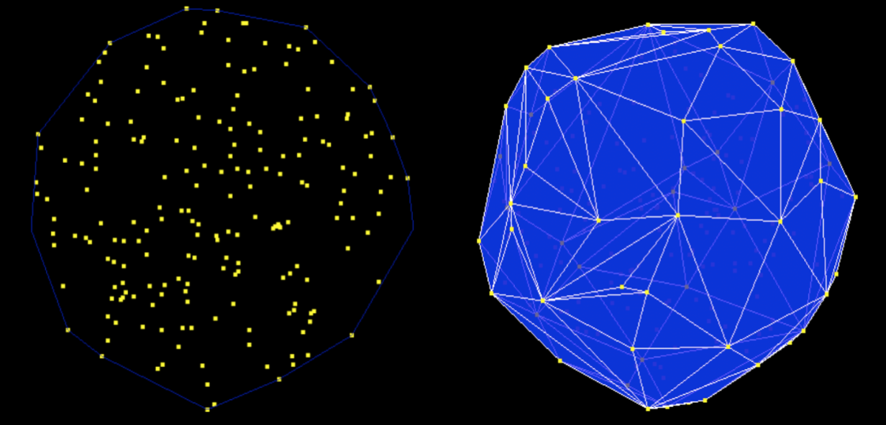

# convex-hull
Constructs a 2d convex hull with the [monotone chain](https://en.wikibooks.org/wiki/Algorithm_Implementation/Geometry/Convex_hull/Monotone_chain) algorithm and a 3d convex hull with the [incremental algorithm](https://en.wikipedia.org/wiki/Convex_hull_algorithms#Algorithms).

Note: Requires Eigen 3.2.4 and assumes it is in /usr/local/Cellar/eigen/3.2.4/include/eigen3/
